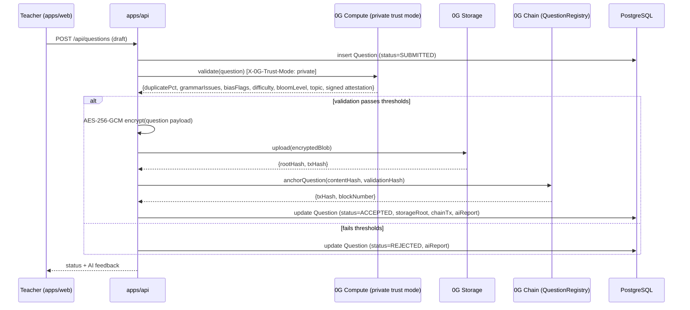
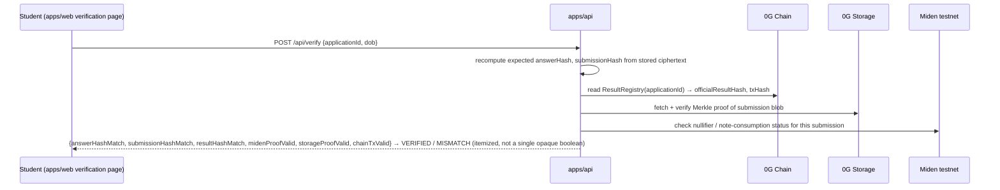

# SYSTEM_ARCHITECTURE.md

Companion to [knowledge_base.md](../knowledge_base.md) — read that first for the ground-truth findings and the "what's real vs. engineered" table this architecture is built on.

> **2026-07-28 status note**: the component map and sequence diagrams below still show Miden testnet as the live timelock/submission-commitment mechanism, reflecting how this doc was originally written. That is no longer the live path. As of 2026-07-28, the paper-key timelock is real drand/tlock (knowledge_base.md §11o-§11p) and double-submission prevention is `SubmissionRegistry`'s own on-chain write-once guard (§11q) — both proven live end-to-end on real mainnet infra. `contracts/miden/bridge/` stays in the repo, dormant, per standing instruction, but nothing in `apps/api` calls it anymore. Read this doc for the overall shape of the pipeline (which is still accurate); mentally substitute "drand/tlock" wherever it says "Miden P2IDE timelock" and "SubmissionRegistry write-once guard" wherever it says "Miden private note + nullifier."

## 1. Component Map

```
                         ┌────────────────────────────────────────────┐
                         │              apps/web (React)               │
                         │  Public: Landing / Explainer site           │
                         │  Teacher Portal · Admin/NTA Dashboard       │
                         │  Center Dashboard · Student Exam Client     │
                         └───────────────┬──────────────────────────────┘
                                         │ REST + WebSocket (live logs)
                         ┌───────────────▼──────────────────────────────┐
                         │              apps/api (Express/TS)           │
                         │  Clean layering: routes → services →        │
                         │  repositories → Prisma                       │
                         │  BullMQ workers: validation, encryption,     │
                         │  paper-generation, evaluation, anchoring     │
                         └───┬───────────┬───────────┬───────────┬─────┘
                             │           │           │           │
                    ┌────────▼──┐ ┌──────▼─────┐ ┌───▼──────┐ ┌──▼─────────────┐
                    │ PostgreSQL │ │   Redis    │ │ 0G Chain │ │  0G Storage    │
                    │ (Prisma)   │ │  (BullMQ)  │ │ (EVM L1) │ │ (encrypted     │
                    │ metadata,  │ │  job queue │ │ registry │ │  blob store)   │
                    │ audit log  │ │            │ │ contracts│ │                │
                    └────────────┘ └────────────┘ └──────────┘ └────────────────┘
                             │
                    ┌────────▼─────────┐        ┌──────────────────────────┐
                    │  0G Compute       │        │   Miden testnet client   │
                    │  Router API       │        │   (miden-client Rust /   │
                    │  (private/verified│        │    @miden-sdk/web bridge)│
                    │  trust mode)      │        │   P2IDE timelock notes,  │
                    │  AI validation    │        │   private submission     │
                    └───────────────────┘        │   notes, nullifiers      │
                                                  └──────────────────────────┘
```

## 2. Why each technology sits where it does

| Layer | Technology | Reason |
|---|---|---|
| Public record / verifiable anchors | 0G Chain (EVM, mainnet Aristotle) | Only one of the two chains here has a real mainnet; this is where a citizen/court/auditor looks up a hash with a standard block explorer, no special client needed. |
| Encrypted content storage | 0G Storage | Real decentralized blob store with Merkle-proof downloads and native client-side AES-256-CTR; question/paper/answer blobs never touch a centralized disk in plaintext. |
| AI validation with hardware attestation | 0G Compute, `private` trust mode | The only place in this stack where a genuine TEE (Intel TDX) claim is honest — verified live against `pc.0g.ai/models` on 2026-07-26. |
| Time-locked key release, private submission commitments, double-submission prevention | Miden testnet | Real primitives (P2IDE timelock, private notes, nullifiers) map directly onto "paper key can't unlock before exam start" and "you can't submit twice" — but testnet-only, badged as such everywhere. |
| Deterministic app logic (paper assembly, evaluation) | apps/api, access-controlled + fully audited | Not an inference task, so not a 0G Compute fit; not claimed to run in a hardware enclave — see knowledge_base.md §3. |

## 3. Sequence — Question Submission → On-Chain Anchor



## 4. Sequence — Paper Generation (Blueprint → Master Paper → Timelocked Key)

```mermaid
sequenceDiagram
    participant A as Admin (apps/web)
    participant API as apps/api (Paper Generation service)
    participant DB as PostgreSQL
    participant ST as 0G Storage
    participant CH as 0G Chain (PaperRegistry)
    participant MD as Miden testnet client

    A->>API: POST /api/blueprints (publish)
    API->>DB: insert Blueprint
    A->>API: POST /api/papers/generate {blueprintId, examStartAt}
    API->>DB: select ACCEPTED questions matching blueprint %s
    API->>API: assemble Master Paper (deterministic selection, generate per-student randomization seeds)
    API->>API: generate fresh content key K; encrypt Master Paper with K
    API->>ST: upload(encryptedMasterPaper)
    ST-->>API: {rootHash}
    API->>CH: anchorPaper(masterPaperHash, blueprintHash)
    API->>MD: create P2IDE note carrying wrapped(K), timelock_height=blockAt(examStartAt), reclaim_height=blockAt(examWindowClose)
    MD-->>API: {noteId}
    API->>DB: update Paper (status=READY, storageRoot, chainTx, midenNoteId)
```

## 5. Sequence — Student Verification (self-service, no trust required)



## 6. Non-goals for v1 (explicit, to prevent scope creep during Phase 4)

- No literal hardware-enclave execution of the paper-assembly/evaluation business logic (see knowledge_base.md §3 gap).
- No production identity-proofing/biometric layer for students — Application ID + DOB matches the brief's "Student Verification" spec; a real deployment would integrate India Stack (Aadhaar/DigiLocker) but that's outside the supplied docs.
- No production load-bearing infra (multi-region, HA Postgres, etc.) — this is a demonstrable prototype, documented in DEPLOYMENT.md as "what production hardening would add."
